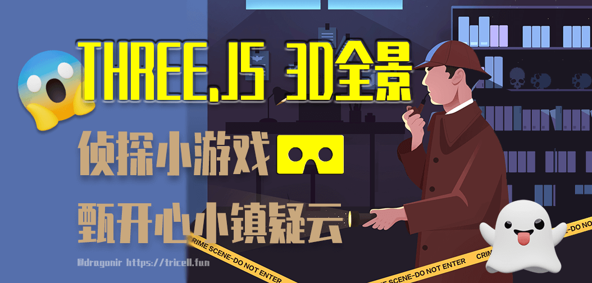
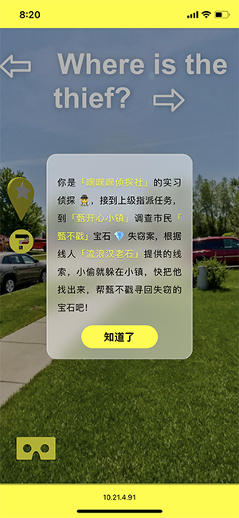
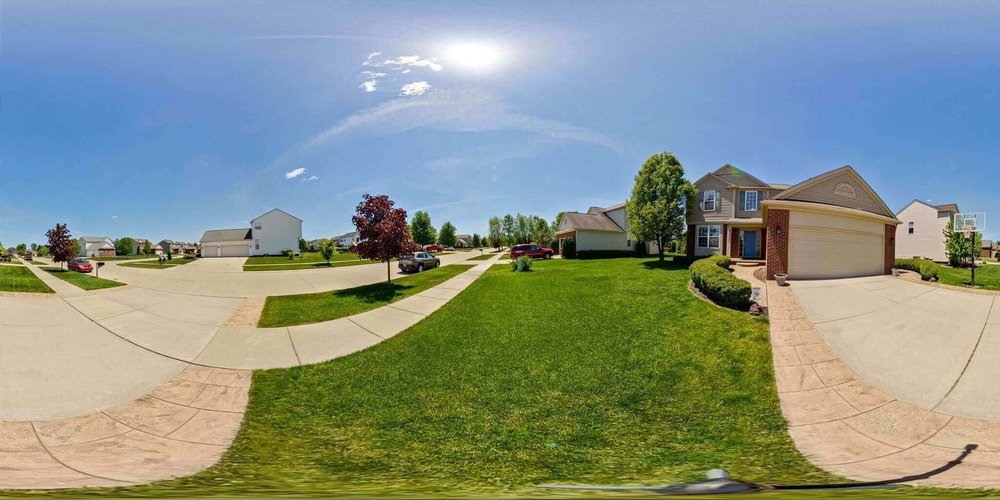
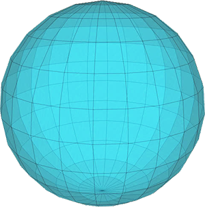
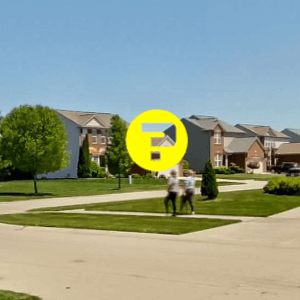
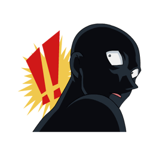
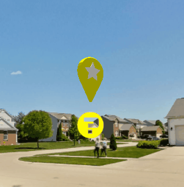
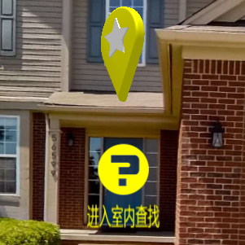

# Three.js 实现3D全景侦探小游戏 🕵️



## 背景

> 你是**嘿嘿嘿侦探社**实习侦探🕵️，接到上级指派任务，到**甄开心小镇🏠**调查市民**甄不戳👨**宝石💎失窃案，根据线人**流浪汉老石👨‍🎤**提供的线索，小偷就躲在小镇，快把他找出来，帮甄不戳寻回失窃的宝石吧！

本文使用 `Three.js` `SphereGeometry` 创建 `3D` 全景图预览功能，并在全景图中添加二维 `SpriteMaterial`、`Canvas`、三维 `GLTF` 等交互点，实现具备场景切换、点击交互的侦探小游戏。

## 实现效果

左右滑动屏幕，找到 `3D` 全景场景中的 `交互点` 并点击，找出嫌疑人真正躲藏的位置。


已适配移动端，可以在手机上打开访问。



> `💡` 在线预览：<https://dragonir.github.io/3d-panoramic-vision/>

## 代码实现

### 初始化场景

创建场景，添加摄像机、光源、渲染。

```js
// 透视摄像机
camera = new THREE.PerspectiveCamera(75, window.innerWidth / window.innerHeight, 1, 1100);
camera.target = new THREE.Vector3(0, 0, 0);
scene = new THREE.Scene();
// 添加环境光
light = new THREE.HemisphereLight(0xffffff);
light.position.set(0, 40, 0);
scene.add(light);
// 添加平行光
light = new THREE.DirectionalLight(0xffffff);
light.position.set(0, 40, -10);
scene.add(light);
// 渲染
renderer = new THREE.WebGLRenderer();
renderer.setPixelRatio(window.devicePixelRatio);
renderer.setSize(window.innerWidth, window.innerHeight);
container.appendChild(renderer.domElement);
```

### 使用球体实现全景功能

```js
// 创建全景场景
geometry = new THREE.SphereGeometry(500, 60, 60);
// 按z轴翻转
geometry.scale(1, 1, -1);
// 添加室外低画质贴图
outside_low = new THREE.MeshBasicMaterial({
  map: new THREE.TextureLoader().load('./assets/images/outside_low.jpg')
});
// 添加室内低画质贴图
inside_low = new THREE.MeshBasicMaterial({
  map: new THREE.TextureLoader().load('./assets/images/inside_low.jpg')
});
mesh = new THREE.Mesh(geometry, outside_low);
// 异步加载高清纹理图
new THREE.TextureLoader().load('./assets/images/outside.jpg', texture => {
  outside = new THREE.MeshBasicMaterial({
    map: texture
  });
  mesh.material = outside;
});
// 添加到场景中
scene.add(mesh);
```



> `📌` 全景贴图如上图所示，图片来源于 `Bing`。

`💡` 球体 `SphereGeometry`



构造函数：

```js
THREE.SphereGeometry(radius, segmentsWidth, segmentsHeight, phiStart, phiLength, thetaStart, thetaLength)
```

* `radius`：半径；
* `segmentsWidth`：经度上的分段数；
* `segmentsHeight`：纬度上的分段数；
* `phiStart`：经度开始的弧度；
* `phiLength`：经度跨过的弧度；
* `thetaStart`：纬度开始的弧度；
* `thetaLength`：纬度跨过的弧度。

`💡` 基础网格材质 `MeshBasicMaterial`

球体的材质使用的是 `MeshBasicMaterial`, 是一种简单的材质，这种材质不受场景中光照的影响。使用这种材质的网格会被渲染成简单的平面多边形，而且也可以显示几何体的线框。

构造函数：

```js
MeshBasicMaterial(parameters: Object)
```

`parameters` ：（可选）用于定义材质外观的对象，具有一个或多个属性。

属性：

* `.alphaMap[Texture]`：`alpha` 贴图是一张灰度纹理，用于控制整个表面的不透明度。（`黑色：完全透明；白色：完全不透明`）。默认值为 `null`。
* `.aoMap[Texture]`：该纹理的红色通道用作环境遮挡贴图。默认值为 `null`。
* `.aoMapIntensity[Float]`：环境遮挡效果的强度。默认值为 `1`。零是不遮挡效果。
* `.color[Color]`：材质的颜色，默认值为白色 `0xffffff`。
* `.combine[Integer]`：如何将表面颜色的结果与环境贴图（如果有）结合起来。选项为`THREE.Multiply`（默认值），`THREE.MixOperation`，`THREE.AddOperation`。如果选择多个，则使用 `.reflectivity` 在两种颜色之间进行混合。
* `.envMap[Texture]`：环境贴图。默认值为 `null`。
* `.lightMap[Texture]`：光照贴图。默认值为 `null`。
* `.lightMapIntensity[Float]`：烘焙光的强度。默认值为 `1`。
* `.map[Texture]`：纹理贴图。默认为 `null`。
* `.morphTargets[Boolean]`：材质是否使用 `morphTargets`。默认值为 `false`。
* `.reflectivity[Float]`：环境贴图对表面的影响程度，默认值为 `1`，有效范围介于 `0`（无反射）和 `1`（完全反射）之间。
* `.refractionRatio[Float]`：折射率不应超过 `1`。默认值为 `0.98`。
* `.specularMap[Texture]`：材质使用的高光贴图。默认值为 `null`。
* `.wireframe[Boolean]`：将几何体渲染为线框。默认值为 `false`（即渲染为平面多边形）。
* `.wireframeLinecap[String]`：定义线两端的外观。可选值为 `butt`，`round` 和 `square`。默认为 `round`。
* `.wireframeLinejoin[String]`：定义线连接节点的样式。可选值为 `round`, `bevel` 和 `miter`。默认值为 `round`。
* `.wireframeLinewidth[Float]`：控制线框宽度。默认值为 `1`。

`💡` `TextureLoader`

`TextureLoader` 从给定的URL开始加载并将完全加载的 `texture` 传递给 `onLoad`。该方法还返回一个新的纹理对象，该纹理对象可以直接用于材质创建，加载材质的一个类，内部使用 `ImageLoader` 来加载文件。

构造函数：

```js
TextureLoader(manager: LoadingManager)
```

* `manager`：加载器使用的 `loadingManager`，默认值为 `THREE.DefaultLoadingManager`。

方法：

```js
.load(url: String, onLoad: Function, onProgress: Function, onError: Function) : Texture
```

* `url`：文件的 `URL` 或者路径，也可以为 `Data URI`。
* `onLoad`：加载完成时将调用。回调参数为将要加载的 `texture`。
* `onProgress`：将在加载过程中进行调用。参数为 `XMLHttpRequest` 实例，实例包含 `total` 和 `loaded` 参数。
* `onError`：在加载错误时被调用。

### 添加交互点

新建交互点数组，包含每个交互点的名称、缩放比例、空间坐标。

```js
var interactPoints = [
  { name: 'point_0_outside_house', scale: 2, x: 0, y: 1.5, z: 24 },
  { name: 'point_1_outside_car', scale: 3, x: 40, y: 1, z: -20 },
  { name: 'point_2_outside_people', scale: 3, x: -20, y: 1, z: -30 },
  { name: 'point_3_inside_eating_room', scale: 2, x: -30, y: 1, z: 20 },
  { name: 'point_4_inside_bed_room', scale: 3, x: 48, y: 0, z: -20 }
];
```

#### 添加二维静态图片交互点



```js
let pointMaterial = new THREE.SpriteMaterial({
  map: new THREE.TextureLoader().load('./assets/images/point.png')
});
interactPoints.map(item => {
  let point = new THREE.Sprite(pointMaterial);
  point.name = item.name;
  point.scale.set(item.scale * 1.2, item.scale * 1.2, item.scale * 1.2);
  point.position.set(item.x, item.y, item.z);
  scene.add(point);
});
```

`💡` 精灵材质 `SpriteMaterial`

构造函数:

```js
SpriteMaterial(parameters : Object)
```

* `parameters`：可选，用于定义材质外观的对象，具有一个或多个属性。材质的任何属性都可以从此处传入(包括从 `Material` 和 `ShaderMaterial` 继承的任何属性)。
* `SpriteMaterials` 不会被 `Material.clippingPlanes` 裁剪。

属性：

`.alphaMap[Texture]`：`alpha` 贴图是一张灰度纹理，用于控制整个表面的不透明度。默认值为 `null`。
`.color[Color]`：材质的颜色，默认值为白色 `0xffffff`。 `.map` 会和 `color` 相乘。
`.map[Texture]`：颜色贴图。默认为 `null`。
`.rotation[Radians]`：`sprite` 的转动，以弧度为单位。默认值为 `0`。
`.sizeAttenuation[Boolean]`：精灵的大小是否会被相机深度衰减。（仅限透视摄像头。）默认为 `true`。

使用同样的方法，加载**嫌疑人**二维图片添加到场景中。



```js
function loadMurderer() {
  let material = new THREE.SpriteMaterial({
    map: new THREE.TextureLoader().load('./assets/models/murderer.png')
  });
  murderer = new THREE.Sprite(material);
  murderer.name = 'murderer';
  murderer.scale.set(12, 12, 12);
  murderer.position.set(43, -3, -20);
  scene.add(murderer);
}
```

#### 添加三维动态模型锚点

通过加载地标锚点形状的 `gltf` 模型来实现三维动态锚点，加载 `gltf` 需要单独引入  `GLTFLoader.js`，地标模型使用 `Blender` 构建。



```js
var loader = new THREE.GLTFLoader();
loader.load('./assets/models/anchor.gltf', object => {
  object.scene.traverse(child => {
    if (child.isMesh) {
      // 修改材质样式
      child.material.metalness = .4;
      child.name.includes('黄') && (child.material.color = new THREE.Color(0xfffc00))
    }
  });
  object.scene.rotation.y = Math.PI / 2;
  interactPoints.map(item => {
    let anchor = object.scene.clone();
    anchor.position.set(item.x, item.y + 3, item.z);
    anchor.name = item.name;
    anchor.scale.set(item.scale * 3, item.scale * 3, item.scale * 3);
    scene.add(anchor);
  })
});
```

需要在 `requestAnimationFrame` 中通过修改模型的 `rotation` 来实现自传动画效果。

```js
function animate() {
  requestAnimationFrame(animate);
  anchorMeshes.map(item => {
    item.rotation.y += 0.02;
  });
}
```

#### 添加二维文字提示

可以使用 `Canvas` 创建文字提示添加到场景中。



```js
function makeTextSprite(message, parameters) {
  if (parameters === undefined) parameters = {};
  var fontface = parameters.hasOwnProperty("fontface") ? parameters["fontface"] : "Arial";
  var fontsize = parameters.hasOwnProperty("fontsize") ? parameters["fontsize"] : 32;
  var borderThickness = parameters.hasOwnProperty("borderThickness") ? parameters["borderThickness"] : 4;
  var borderColor = parameters.hasOwnProperty("borderColor") ? parameters["borderColor"] : { r: 0, g: 0, b: 0, a: 1.0 };
  var canvas = document.createElement('canvas');
  var context = canvas.getContext('2d');
  context.font = fontsize + "px " + fontface;
  var metrics = context.measureText(message);
  var textWidth = metrics.width;
  context.strokeStyle = "rgba(" + borderColor.r + "," + borderColor.g + "," + borderColor.b + "," + borderColor.a + ")";
  context.lineWidth = borderThickness;
  context.fillStyle = "#fffc00";
  context.fillText(message, borderThickness, fontsize + borderThickness);
  context.font = 48 + "px " + fontface;
  var texture = new THREE.Texture(canvas);
  texture.needsUpdate = true;
  var spriteMaterial = new THREE.SpriteMaterial({ map: texture });
  var sprite = new THREE.Sprite(spriteMaterial);
  return sprite;
}
```

使用方法：

```js
outsideTextTip = makeTextSprite('进入室内查找');
outsideTextTip.scale.set(2.2, 2.2, 2)
outsideTextTip.position.set(-0.35, -1, 10);
scene.add(outsideTextTip);
```

* `💡` `Canvas` 画布可以作为 `Three.js` 纹理贴图 `CanvasTexture`。`Canvas` 画布可以通过 `2D API` 绘制各种各样的几何形状，可以通过 `Canvas` 绘制一个轮廓后然后作为 `Three.js` 网格模型、精灵模型等模型对象的纹理贴图。
* `💡` `measureText()`方法返回一个对象，该对象包含以像素计的指定字体宽度。如果您需要在文本向画布输出之前，就了解文本的宽度，那么请使用该方法。`measureText` 语法：`context.measureText(text).width`。

#### 添加三维文字提示

由于时间有限，`三维文字` 本示例中并未用到，但是在页面中使用 `3D` 文字会实现更好的视觉效果，想了解具体实现细节，可以阅读我的另一篇文章，后续的**鼠标捕获**等内容也在该文中有详细讲解。

> `🔗` 传送门：[使用three.js实现炫酷的酸性风格3D页面](https://juejin.cn/post/7012996721693163528)

### 鼠标捕获

使用 `Raycaster` 获取点击选中网格对象，并添加点击交互。

```js
function onDocumentMouseDown(event) {
  raycaster.setFromCamera(mouse, camera);
  var intersects = raycaster.intersectObjects(interactMeshes);
  if (intersects.length > 0) {
    let name = intersects[0].object.name;
    if (name === 'point_0_outside_house') {
      camera_time = 1;
    } else if (name === 'point_4_inside_bed_room') {
      Toast('小偷就在这里', 2000);
      loadMurderer();
    } else {
      Toast(`小偷不在${name.includes('car') ? '车里' : name.includes('people') ? '人群' : name.includes('eating') ? '餐厅' : '这里'}`, 2000);
    }
  }
  onPointerDownPointerX = event.clientX;
  onPointerDownPointerY = event.clientY;
  onPointerDownLon = lon;
  onPointerDownLat = lat;
}
```

### 场景切换

```js
function update() {
  lat = Math.max(-85, Math.min(85, lat));
  phi = THREE.Math.degToRad(90 - lat);
  theta = THREE.Math.degToRad(lon);
  camera.target.x = 500 * Math.sin(phi) * Math.cos(theta);
  camera.target.y = 500 * Math.cos(phi);
  camera.target.z = 500 * Math.sin(phi) * Math.sin(theta);
  camera.lookAt(camera.target);
  if (camera_time > 0 && camera_time < 50) {
    camera.target.x = 0;
    camera.target.y = 1;
    camera.target.z = 24;
    camera.lookAt(camera.target);
    camera.fov -= 1;
    camera.updateProjectionMatrix();
    camera_time++;
    outsideTextTip.visible = false;
  } else if (camera_time === 50) {
    lat = -2;
    lon = 182;
    camera_time = 0;
    camera.fov = 75;
    camera.updateProjectionMatrix();
    mesh.material = inside_low;
    // 加载新的全景图场景
    new THREE.TextureLoader().load('./assets/images/inside.jpg', function (texture) {
      inside = new THREE.MeshBasicMaterial({
        map: texture
      });
      mesh.material = inside;
    });
    loadMarker('inside');
  }
  renderer.render(scene, camera);
}
```

* `💡` 透视相机的属性创建完成后我们可以根据个人需求随意修改，但是相机的属性修改后，需要调用 `updateProjectionMatrix()` 方法来更新。
* `💡` `THREE.Math.degToRad`：将度转化弧度。

到这里，`3D` 全景功能全部实现。

> `🔗` 完整代码：<https://github.com/dragonir/3d-panoramic-vision>

## 总结

本案例主要涉及到的知识点包括：

* 球体 `SphereGeometry`
* 基础网格材质 `MeshBasicMaterial`
* 精灵材质 `SpriteMaterial`
* 材质加载 `TextureLoader`
* 文字纹理 `Canvas`
* 鼠标捕获 `Raycaster`

## 参考资料

* [1]. [在React中用Three.js实现Web VR全景看房](https://juejin.cn/post/6878224140340297736)
* [2]. [使用three.js实现炫酷的酸性风格3D页面](https://juejin.cn/post/7012996721693163528)


> 作者：dragonir  本文地址：
