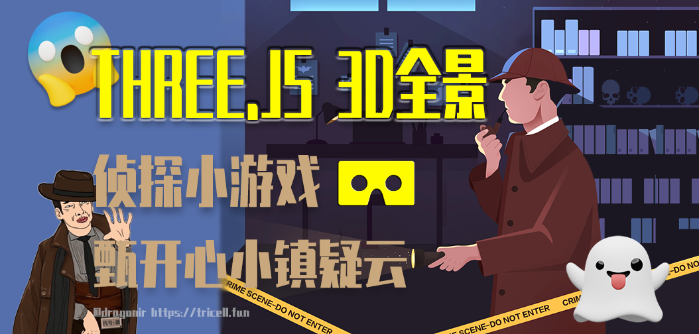

# Three.js 实现全景预览



## 背景

> 你是`「嘿嘿嘿侦探社」`实习侦探 `🕵️`‍，接到上级指派任务，到`「甄开心小镇」`调查市民`「甄不戳」`宝石 `💎` 失窃案，根据线人`「流浪汉老石」`提供的线索，小偷就躲在小镇，快把他找出来，帮甄不戳寻回失窃的宝石吧！

## 实现效果


支持移动端


> 在线预览：https://dragonir.github.io/3d-panoramic-vision/


## 代码实现

### 球体（SphereGeometry）

构造函数：

```js
THREE.SphereGeometry(radius, segmentsWidth, segmentsHeight, phiStart, phiLength, thetaStart, thetaLength)
```

* `radius`：半径；
* `segmentsWidth`：经度上的分段数；
* `segmentsHeight`：纬度上的分段数；
* `phiStart`：经度开始的弧度；
* `phiLength`：经度跨过的弧度；
* `thetaStart`：纬度开始的弧度；
* `thetaLength`：纬度跨过的弧度。

> 完整代码：https://github.com/dragonir/3d-panoramic-vision

## 参考资料
